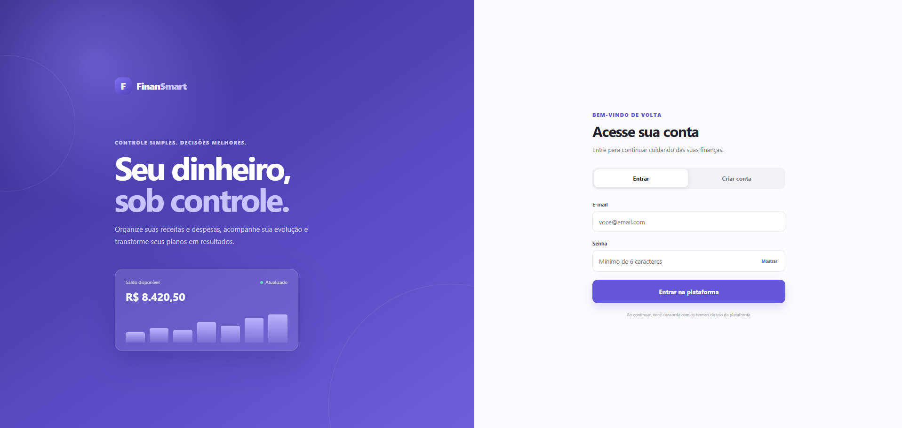
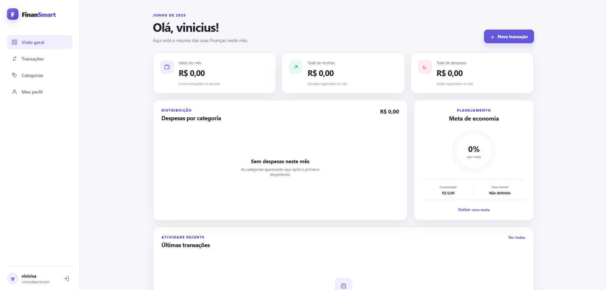
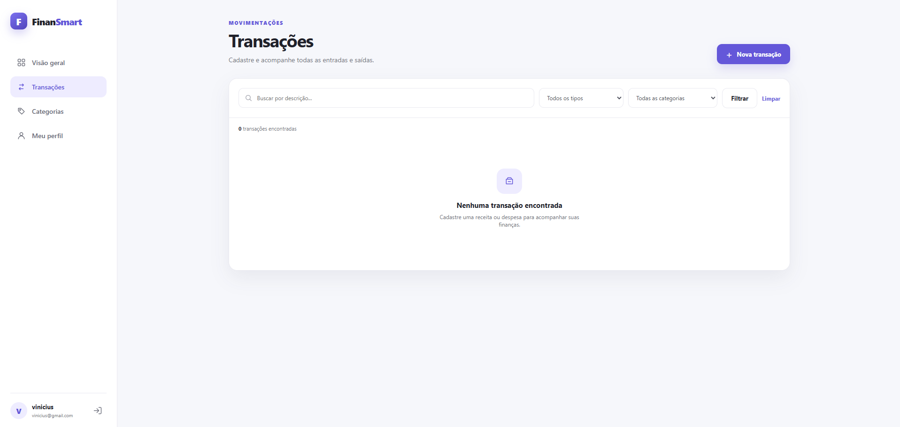
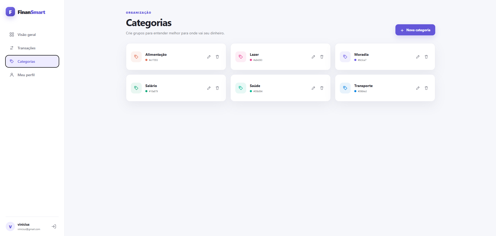

# FinanSmart

Sistema web de controle financeiro pessoal desenvolvido para o trabalho da 3ª nota de Programação Web.

## Objetivo

O FinanSmart ajuda o usuário a registrar receitas e despesas, organizar movimentações em categorias, visualizar o saldo do mês e acompanhar uma meta mensal de economia.

## Funcionalidades

- Cadastro e autenticação de usuários
- Sessão gerenciada com Pinia
- Dashboard com saldo, receitas e despesas
- Resumo de gastos por categoria
- CRUD completo de transações
- Busca e filtros de transações
- CRUD completo de categorias
- Perfil e meta mensal
- Interface responsiva
- Isolamento dos dados de cada usuário com Row Level Security

## Tecnologias

| Camada | Tecnologias |
| --- | --- |
| Front-end | Vue.js, Pinia, Vue Router, Axios e Vite |
| Back-end | Node.js e Express |
| Banco e autenticação | Supabase e PostgreSQL |
| Versionamento | Git e GitHub |

## Telas

<<<<<<< HEAD
> As capturas devem ser geradas depois da configuração do Supabase.

<<<<<<< HEAD
=======
>>>>>>> 98b51b329316d580a1c38e4c273dbc753a34ddd5
<table>
  <tr>
    <th width="50%">Login</th>
    <th width="50%">Dashboard</th>
  </tr>
  <tr>
    <td></td>
    <td></td>
  </tr>
  <tr>
    <th width="50%">Transações</th>
    <th width="50%">Categorias</th>
  </tr>
  <tr>
<<<<<<< HEAD
    <td></td>
    <td></td>
  </tr>
</table>
=======
| Login | Dashboard |
| --- | --- |
| 
 |
 |

| Transações | Categorias |
| --- | --- |
| 
 |
 |
>>>>>>> 578a70618567daf73dc78a0e03122e288fa11f61

=======
    <td></td>
    <td></td>
  </tr>
</table>
>>>>>>> 98b51b329316d580a1c38e4c273dbc753a34ddd5
## Estrutura do projeto

```text
.
├── client/
│   └── src/
│       ├── assets/
│       ├── components/
│       ├── layouts/
│       ├── router/
│       ├── services/
│       ├── stores/
│       ├── utils/
│       └── views/
├── server/
│   └── src/
│       ├── config/
│       ├── middleware/
│       ├── routes/
│       └── utils/
├── supabase/
│   └── schema.sql
└── docs/
```

## Banco de dados

O sistema usa três tabelas:

- `profiles`: dados de perfil e meta mensal
- `categories`: categorias personalizadas
- `transactions`: receitas e despesas

As políticas RLS garantem que cada usuário consulte e altere somente seus próprios registros.

## Como executar

### Pré-requisitos

- Node.js 20 ou superior
- Conta gratuita no Supabase

### 1. Instale as dependências

```bash
npm install
```

### 2. Configure o Supabase

1. Crie um projeto em [supabase.com](https://supabase.com).
2. Abra o SQL Editor.
3. Execute todo o arquivo `supabase/schema.sql`.
4. Em `Authentication > Providers > Email`, habilite o login por e-mail.
5. Para este trabalho acadêmico, desative a confirmação obrigatória de e-mail. Assim o usuário consegue entrar logo após criar a conta.

### 3. Configure as variáveis

Copie `server/.env.example` para `server/.env`:

```env
PORT=3000
CLIENT_URL=http://localhost:5173
SUPABASE_URL=https://seu-projeto.supabase.co
SUPABASE_ANON_KEY=sua-chave-anonima
```

Copie `client/.env.example` para `client/.env`:

```env
VITE_API_URL=http://localhost:3000/api
```

A URL e a chave anônima estão em `Project Settings > API` no painel do Supabase.

### 4. Inicie o sistema

```bash
npm run dev
```

Abra `http://localhost:5173`.

## Comandos

```bash
npm run dev
npm run build
npm run lint
npm test
```

## Arquitetura

```mermaid
flowchart LR
  U[Usuário] --> V[Vue.js]
  V --> P[Pinia]
  V --> A[API Express]
  A --> S[Supabase Auth]
  A --> D[(PostgreSQL)]
```



O navegador envia o token de acesso à API Express. A API valida a sessão no Supabase e executa as operações usando as políticas RLS do usuário autenticado.

## Entrega

- Relatório: `docs/RELATORIO_ENTREGA.md`
- Roteiro do vídeo: `docs/ROTEIRO_VIDEO.md`
- Script do banco: `supabase/schema.sql`

## Integrantes

- Vinicius De Andrade Paz
- Daniel Vinicius Sobral Viana
